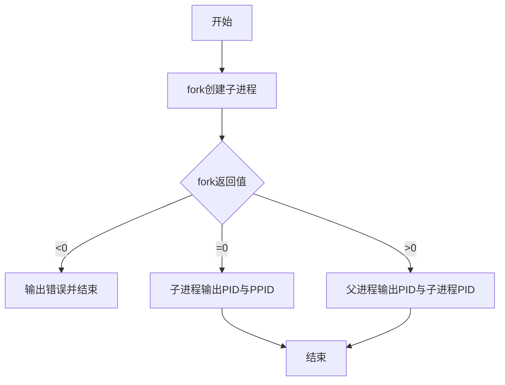
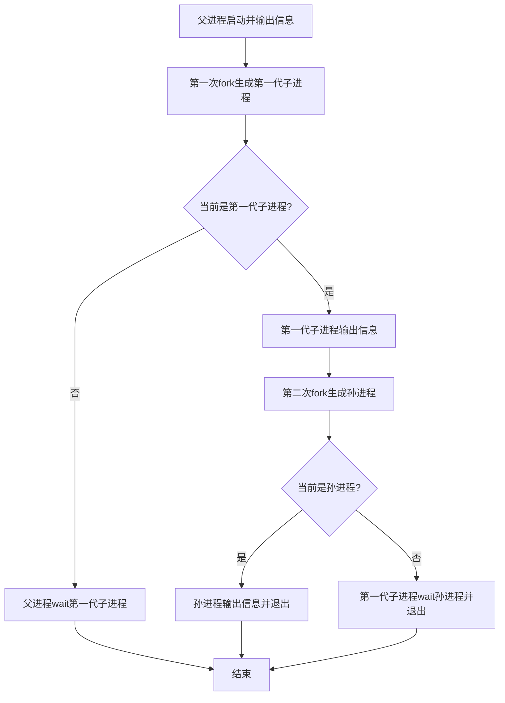
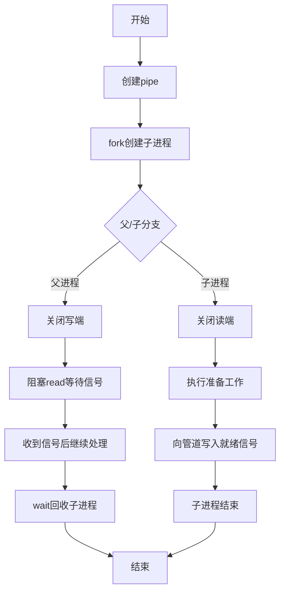
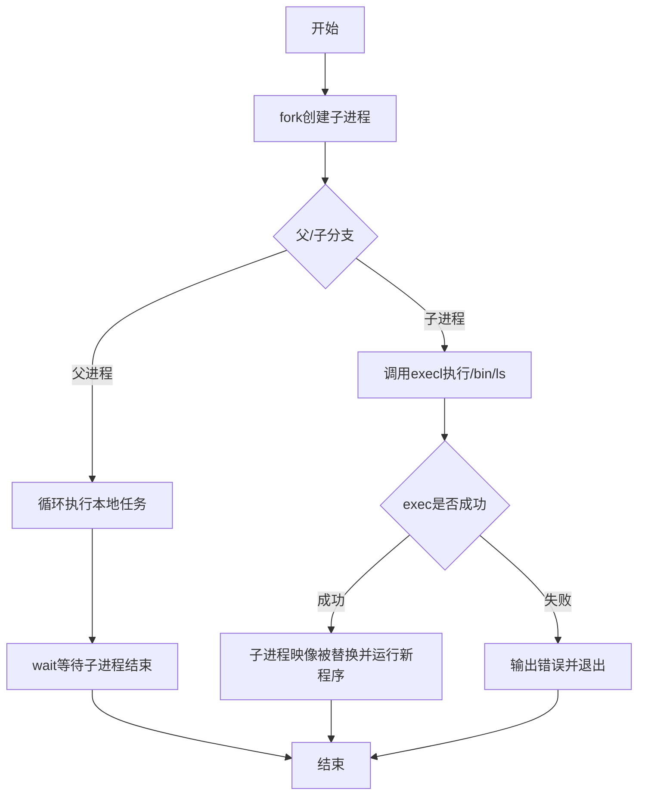
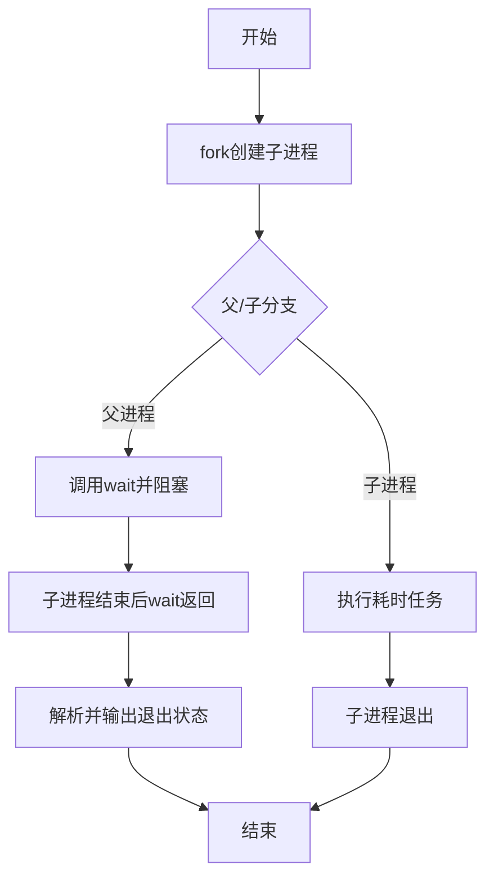

# 进程控制实验报告

## 一、实验目标
1. 掌握父进程创建子进程的基本机制。
2. 理解进程家族树的层级关系。
3. 掌握父子进程同步方法。
4. 理解 fork() 与 exec() 联合使用实现异构并发执行。
5. 掌握 wait() 对父进程阻塞与子进程回收机制。

## 二、实验环境
- 操作系统：Linux
- 编程语言：C
- 编译器：gcc

---

## 实验1：父进程创建子进程

### 流程图


### 文字说明
父进程调用 fork() 后产生一个子进程。通过 fork() 返回值区分父子执行路径：子进程返回 0，父进程返回子进程 PID。两者分别打印自身信息后结束。

---

## 实验2：进程家族树

### 流程图


### 文字说明
父进程先创建第一代子进程，随后第一代子进程再创建孙进程，形成三层结构。通过每层进程输出 PID/PPID，可观察家族树关系；通过 wait() 保证层级结束顺序清晰。

---

## 实验3：父子同步进程

### 流程图


### 文字说明
利用无名管道实现同步：子进程准备完成后向管道写入信号；父进程在 read() 处阻塞等待，收到信号后才继续执行，达到“子先准备、父后处理”的同步效果。

---

## 实验4：fork() + exec() 并发执行

### 流程图


### 文字说明
fork() 后父子并发。子进程通过 exec() 执行与父进程完全不同的程序（/bin/ls），父进程继续执行本地循环任务，体现“同源创建、异构执行”的并发模型。

---

## 实验5：wait() 阻塞父进程

### 流程图


### 文字说明
父进程调用 wait() 后会被阻塞，直到子进程结束。wait() 返回后父进程可读取子进程退出状态，既完成同步也避免僵尸进程。

---

## 三、核心源代码说明
- 实验1源码：`experiments/01_create_child_process.c`
- 实验2源码：`experiments/02_process_family_tree.c`
- 实验3源码：`experiments/03_parent_child_sync.c`
- 实验4源码：`experiments/04_fork_exec_concurrent.c`
- 实验5源码：`experiments/05_wait_block_child.c`

以上源码均以函数为单位提供注释，明确功能、参数、输入输出与返回值；关键语句块均含过程说明。

## 四、运行方式
```bash
gcc experiments/01_create_child_process.c -o exp1
gcc experiments/02_process_family_tree.c -o exp2
gcc experiments/03_parent_child_sync.c -o exp3
gcc experiments/04_fork_exec_concurrent.c -o exp4
gcc experiments/05_wait_block_child.c -o exp5

./exp1
./exp2
./exp3
./exp4
./exp5
```
